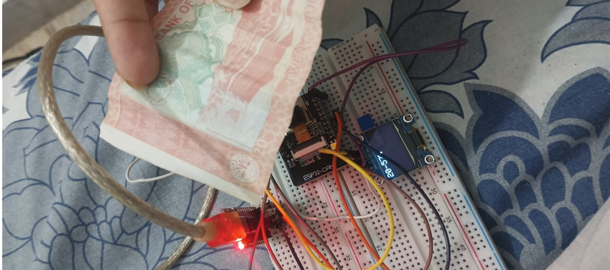

# Object Recognition System using ESP32-CAM

This project is a lightweight, real-time object recognition system focused on detecting Pakistani currency notes (Rs. 20 and Rs. 50) using an **ESP32-CAM module** and **Edge Impulse**. Built as part of the Microprocessor Based System Design (CS-301) course at NED University of Eng & Tech, Karachi, the system demonstrates how AI models can be deployed on low-power embedded devices to perform practical tasks like currency classification.

## Objective

To develop a real-time edge AI solution using the **ESP32-CAM** that can detect and classify two classes of Pakistani currency: **Rs. 20** and **Rs. 50**. The project showcases edge ML deployment with limited resources.

## Hardware Components

- **ESP32-CAM** – Image capture and model execution  
- **FTDI Programmer** – For programming the ESP32-CAM  
- **Jumper Wires** – Electrical connections  
- **OLED Display** – Displays classification results  
- **Mini USB to TTL Serial Converter** – FTDI to laptop connection

## Software & Technologies

- **Edge Impulse** – Dataset collection, model training & deployment  
- **Arduino IDE** – Firmware programming  
- **ESP32 Board Manager** – ESP32 support for Arduino IDE

## Model Details

- **Model Type**: FOMO (Faster Objects, More Objects)  
- **Architecture**: MobileNetV2 (0.35x scaled for edge devices)  
- **Framework**: Edge Impulse  
- **Classes**:  
  - Class 0: Rs. 50  
  - Class 1: Rs. 20  

## Sample Images

| Hardware Circuit | Rs. 20 Detected | Rs. 50 Detected | No Object |
|----------|-----------------|----------------|---------------|
|  |  |  |  |

## Future Implementations

- Expand dataset to recognize full range of Pakistani currency  
- Integrate into smart donation boxes for automatic logging  
- Add audio feedback for **visually impaired users**

## Full Report

Must go through it for details.
[Click here to read the full Open Ended Lab Report (PDF)]([https://your-link-to-report.com/MBSD_OEL_Report.pdf](https://github.com/Anooshakhalid/CurrencyDetection-using--ESP32-CAM/blob/main/docs/MBSD%20OEL%20Report.pdf))

## Contact

For more details or collaboration opportunities, feel free to reach out:

**Email**: anooshakhalid999@gmail.com  
**Department**: Computer Systems Engineering, NED University of Eng & Tech

## Advisor

- **Supervisor**: Miss Ramish Fatima

